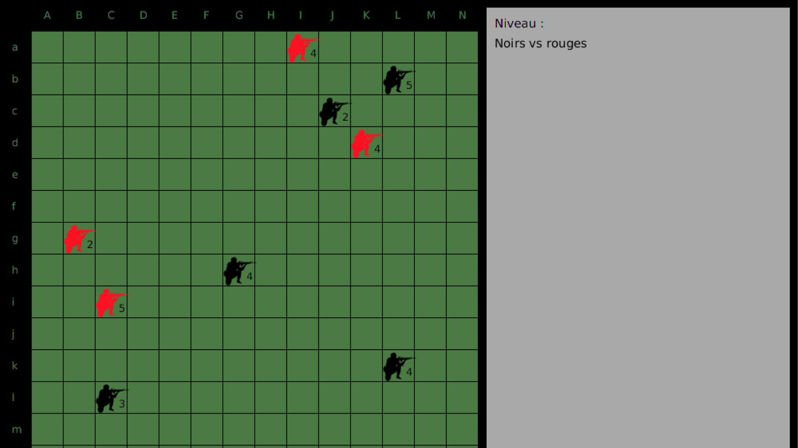

<h1 align="center">Welcome to Lowatem_AI_Minimax 👋</h1>

  

> Board game in which two players compete with groups of 1 to 9 soldiers. The goal is to eliminate all of the opponent's soldiers first. Then, development of an AI capable of beating the opposing players almost every time, whether it is a human or an AI

## Author

👤 **Enzo Mourany**

* Website: enzomourany.com
* Github: [@enzo-mourany](https://github.com/enzo-mourany)

## Show your support

Give a ⭐️ if this project helped you!

